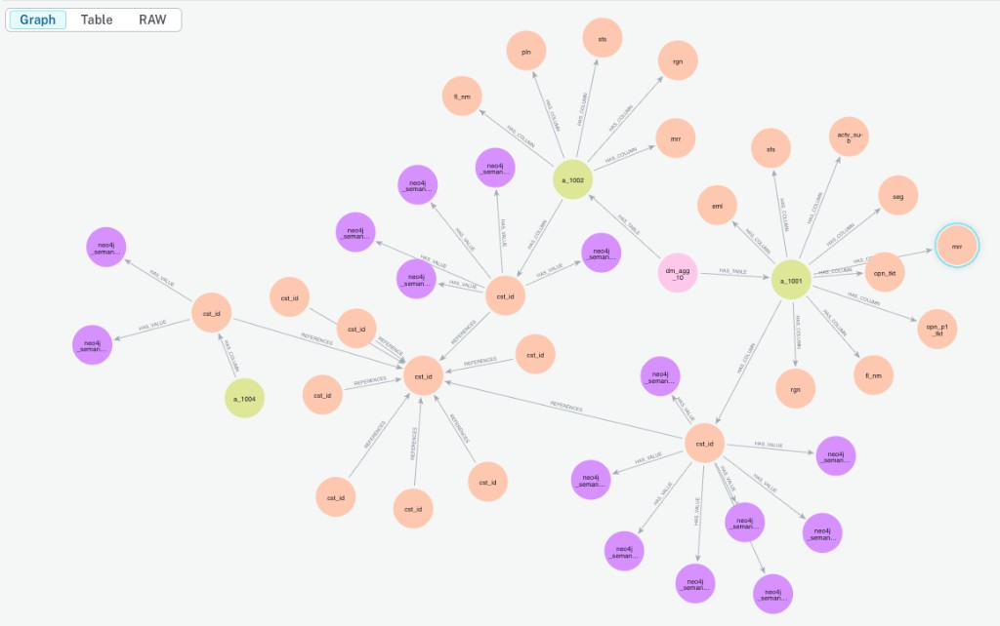
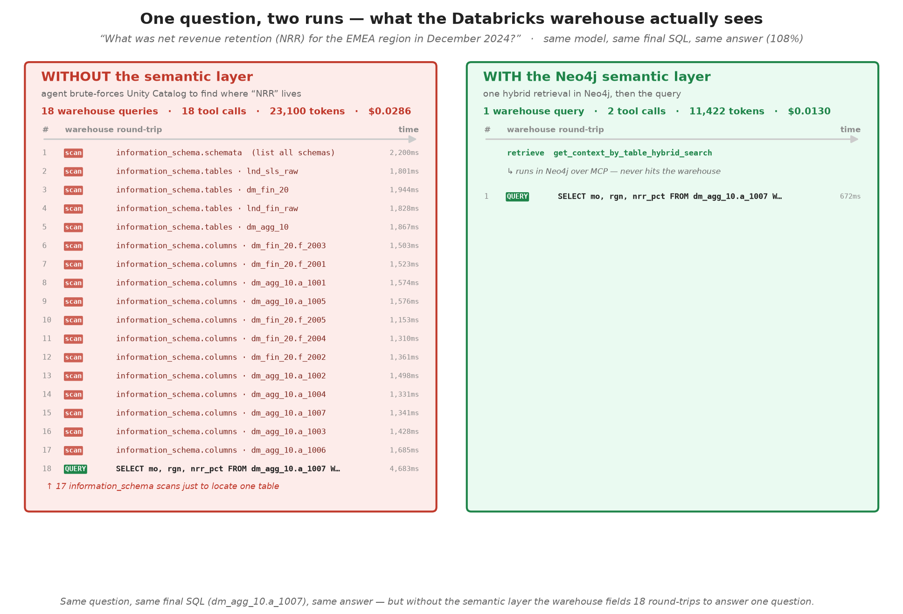
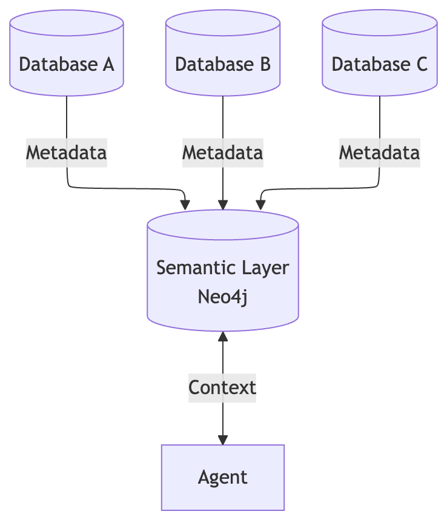

# Text2SQL on Databricks: with vs without a Neo4j semantic layer

Same models, same 11 questions, same [Databricks](https://www.databricks.com/) SQL warehouse — the only variable is whether the agent can retrieve schema from a [Neo4j](https://neo4j.com/) / [Neocarta](https://github.com/neo4j-labs/neocarta) semantic layer.

The lakehouse is a **legacy-style Unity Catalog**: 12 schemas, **264 tables**, **5,614 columns**. Physical names are opaque (`ods_crm_01.t_0140`, `dm_fin_20.f_2001`). Business meaning lives only in `COMMENT` metadata. Dataclass counterpart of the [Census ACS BigQuery benchmark](https://github.com/mbabari/census-neocarta-benchmark).

**Headline (8 Anthropic models × 11 questions):** every model scores **11/11** WITH the layer. Token cut **19–54%**, largest dollar save on expensive models (Opus 4.5: **~$1,527 → $693 / month** at 10k queries). Full tables, talking points, and Unity Catalog vs Neo4j: **[eval/findings.md](eval/findings.md)**.


## The lakehouse


Generated by `[src/lakehouse.py](src/lakehouse.py)`:

- ARR is `dm_fin_20.f_2001`, customer 360 is `dm_agg_10.a_1001`, dunning is `dm_fin_20.f_2004`.
- Near-duplicates: year shards (`x_ord_2016..2025`), marketing “customers”, HR “tickets”, 110 wide `x_feed_*` extracts.
- Governed tables carry real `COMMENT`s — that is what embeddings retrieve.


## How the WITH SL agent works


Two tools, not a Cypher chatbot:

1. `get_context_by_table_hybrid_search` — vector ∪ full-text on Table `COMMENT`, then Cypher expansion of columns and FK `REFERENCES`.
2. `execute_sql` — Databricks SQL warehouse. Text2SQL is the LLM writing SQL from the retrieved **physical** names.

The layer in the Neo4j Browser — `dm_agg_10` → tables (`a_1001`, `a_1002`, `a_1004`) → columns → sample values, with `REFERENCES` edges linking `cst_id` (the join paths the agent follows):



Without the layer the agent brute-forces `list_schemas` / `list_tables` / `get_table_columns` and `information_schema` (4–24 tool calls, often more).

### What the warehouse actually sees

One question ("NRR for EMEA in December 2024?"), same model, same final SQL, same answer — captured live with `[src/capture_query_log.py](src/capture_query_log.py)`:



WITHOUT the layer, Databricks fields **18 round-trips** — 17 `information_schema` scans probing opaque tables (`f_2001`, `a_1001`, …) to find where "NRR" lives — then the real query. WITH it, retrieval runs in Neo4j over MCP (never touches the warehouse), so Databricks sees **one** business query, at half the tokens. Regenerate with `uv run python src/capture_query_log.py --qid q6 --model <id>`.

## Results

Latest sweep: 8 Anthropic models, 11 questions, local embeddings (`eval/results-8models-anthropic.json` is produced locally; numbers live in findings).


| Model             | Tokens w/o | Tokens with | Save | $/q w/o | $/q with | ANSWERS w/o | ANSWERS with |
| ----------------- | ---------- | ----------- | ---- | ------- | -------- | ----------- | ------------ |
| claude-haiku-4-5  | 26,560     | 12,331      | 54%  | $0.033  | $0.014   | 10/11       | **11/11**    |
| claude-sonnet-4-5 | 26,946     | 14,324      | 47%  | $0.096  | $0.049   | 11/11       | **11/11**    |
| claude-sonnet-4-6 | 28,332     | 13,903      | 51%  | $0.102  | $0.048   | 11/11       | **11/11**    |
| claude-opus-4-5   | 25,722     | 11,784      | 54%  | $0.153  | $0.069   | 11/11       | **11/11**    |
| claude-opus-4-8   | 21,053     | 15,563      | 26%  | $0.126  | $0.089   | 11/11       | **11/11**    |
| claude-sonnet-5   | 20,561     | 14,427      | 30%  | $0.048  | $0.033   | 11/11       | **11/11**    |
| claude-opus-5     | 27,079     | 14,056      | 48%  | $0.158  | $0.080   | 11/11       | **11/11**    |
| claude-fable-5    | 17,210     | 13,960      | 19%  | $0.203  | $0.158   | 11/11       | **11/11**    |


Scoring is deterministic: `[eval/questions.yaml](eval/questions.yaml)` has `expected_tables` and `expected_answer` regexes. Write-up: **[eval/findings.md](eval/findings.md)**.

An earlier 5-model run (including GPT, OpenAI embeddings) is kept in findings — gpt-4o-mini went **0/11 → 8/11** WITH the layer.

## Databricks UC semantics vs Neo4j SL

Unity Catalog **Metric Views + Genie** certify KPIs over a **curated** table list. In this workspace a Genie space allows **at most 30 tables**. This catalog has **264**; gold + ODS alone is **31**, so UC SL cannot see the search space this demo is built for.

Details in [findings](eval/findings.md#databricks-unity-catalog-semantics-vs-neo4j-sl).

### One layer, any warehouse

The Neo4j / Neocarta layer is **warehouse-polyglot** — the same connector pattern ingests metadata from **BigQuery, Snowflake, Databricks (Unity Catalog), generic JDBC, GCP Dataplex, CSV, and query-log JSON** into one graph. This repo uses `DatabricksSchemaConnector`; swapping the source is a connector change, not a rewrite of the agent, the graph, or the MCP tools.



## Run it

Python 3.12+, [uv](https://astral.sh/uv/), a Databricks **SQL warehouse** + PAT, Neo4j (Aura or Desktop), Anthropic and/or OpenAI keys.

```bash
uv sync
cp .env.example .env        # warehouse, Neo4j, API keys 

uv run python src/seed_lakehouse.py
uv run python src/build_semantic_layer.py
uv run python src/benchmark.py

uv run python src/agent.py --mode without
uv run python src/agent.py --mode with

uv run python src/make_diagrams.py    # regenerates docs/*.png
```

No OpenAI? Run embeddings locally:

```bash
uv run python src/local_embeddings.py   # keep this running
# .env: EMBEDDING_MODEL=openai/all-mpnet-base-v2
#       EMBEDDING_API_BASE=http://127.0.0.1:8876/v1
uv run python src/build_semantic_layer.py --only embeddings
```


## Layout

```
src/lakehouse.py            # schemas / tables / comments / FKs / seed rows
src/seed_lakehouse.py       # DDL + seed on the SQL warehouse
src/build_semantic_layer.py # Neocarta ingest + embeddings → Neo4j
src/benchmark.py            # models × questions × with/without
src/agent.py                # interactive agent
src/runtime.py              # tools, prompts, scoring
src/capture_query_log.py    # logs warehouse SQL per mode → docs/query_log.json
src/make_diagrams.py        # docs/*.png
eval/questions.yaml         # 11 questions, expected tables and answers
eval/findings.md            # Benchmark results, UC vs Neo4j
docs/                       # catalog map, flow, token and cost charts
sql/lakehouse.sql           # generated DDL
```


