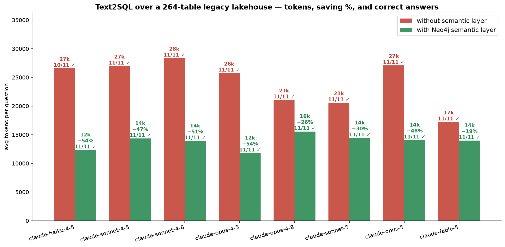
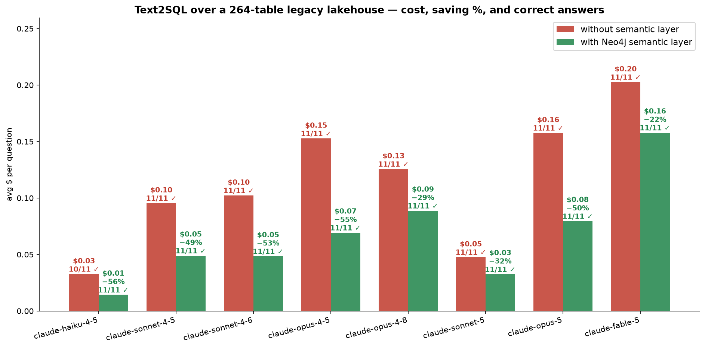
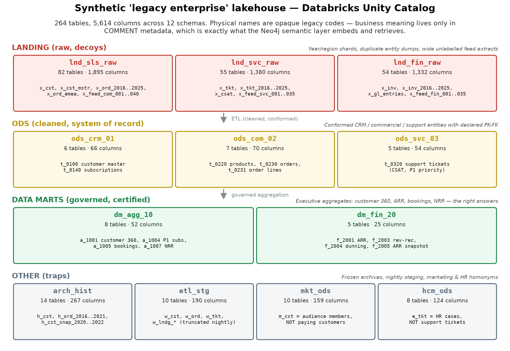
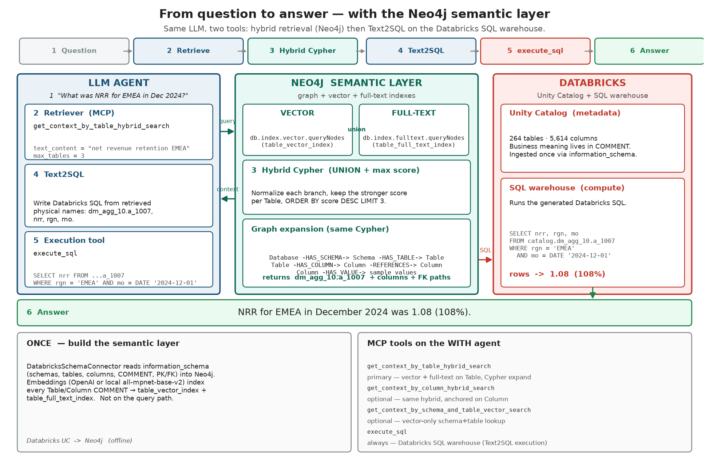

# Databricks lakehouse demo — Neo4j semantic layer (Neocarta) findings





## The setup



- **Data**: generated "legacy enterprise" lakehouse in `DATABRICKS_CATALOG` —
12 schemas, **264 tables, 5,614 columns**. Physical names are opaque codes
(`ods_crm_01.t_0140`, `dm_agg_10.a_1004`, `lnd_sls_raw.x_ord_2024`,
`x_feed_com_017` with unlabelled `fld_001..fld_024`). The business meaning
lives **only in COMMENT metadata**, like a real warehouse migrated from a
legacy system. Near-duplicate copies of every entity exist across landing
shards, archives, staging, marketing and HR homonyms.
- **Semantic layer**: Neo4j graph built from `information_schema` via Neocarta
`DatabricksSchemaConnector`, with table/column embeddings computed from the
COMMENT text and `REFERENCES` edges from declared Unity Catalog PK/FK.
- **Comparison** (only variable = is Neocarta in the loop?):
  - **WITHOUT**: `list_schemas` + `list_tables` + `get_table_columns` +
  `execute_sql` (may also read comments via `information_schema` in SQL —
  the strongest realistic baseline).
  - **WITH**: `get_context_by_table_hybrid_search` (one retrieval) + `execute_sql`.



The WITH path is two tools: hybrid retrieval in Neo4j (vector ∪ full-text on
Table, then Cypher expansion of columns and FK paths) then `execute_sql` on
the Databricks warehouse. Text2SQL is the model writing Databricks SQL from
the retrieved physical names — it is not a Neo4j procedure.

- **Scoring**: TABLES = the generated SQL used the governed table;
ANSWERS = the final answer contained the ground-truth values
(deterministic regex check in `eval/questions.yaml`).


## Latest sweep — 2026-08-20, 8 Anthropic models, fixed questions (11/11)

The token and cost charts at the top of this page, and this section, are the current headline result:
**8 models × 11 questions × 2 modes**
(`eval/results-8models-anthropic.json`). Two changes vs the earlier run:


1. **Embeddings run locally** (`src/local_embeddings.py`,
  `all-mpnet-base-v2`, 768-dim) — no OpenAI dependency. This is why the GPT
   models are absent from this run; the earlier OpenAI-embedding numbers are
   preserved further down.


| Model             | tok w/o | tok with | SAVING  | time w/o SL | time with SL | ANSWERS w/o SL | ANSWERS with SL |
| ----------------- | ------- | -------- | ------- | ----------- | ------------ | -------------- | --------------- |
| claude-haiku-4-5  | 26,560  | 12,331   | **54%** | 19.5s       | 6.9s         | 10/11          | **11/11**       |
| claude-sonnet-4-5 | 26,946  | 14,324   | **47%** | 29.4s       | 12.9s        | 11/11          | **11/11**       |
| claude-sonnet-4-6 | 28,332  | 13,903   | **51%** | 34.2s       | 13.7s        | 11/11          | **11/11**       |
| claude-opus-4-5   | 25,722  | 11,784   | **54%** | 25.3s       | 11.3s        | 11/11          | **11/11**       |
| claude-opus-4-8   | 21,053  | 15,563   | **26%** | 22.0s       | 10.1s        | 11/11          | **11/11**       |
| claude-sonnet-5   | 20,561  | 14,427   | **30%** | 19.2s       | 9.0s         | 11/11          | **11/11**       |
| claude-opus-5     | 27,079  | 14,056   | **48%** | 27.8s       | 8.8s         | 11/11          | **11/11**       |
| claude-fable-5    | 17,210  | 13,960   | **19%** | 37.5s       | 21.9s        | 11/11          | **11/11**       |


Takeaways:

- **Every model reaches 11/11 correct answers WITH the semantic layer.** Haiku
4.5 improves from 10/11 → 11/11 *because* of the layer.
- **19–54% fewer tokens and ~2× faster** across the whole Anthropic range,
cheap to flagship. WITH the layer each question converges to 2 tool calls
(one retrieval + one SQL) vs 4–24 brute-force calls without.
- Even models that already answer 11/11 without the layer pay a large
brute-force tax in tokens, latency, and $/month that the layer removes.
- **Token savings on more expensive models translate to larger dollar savings.**
Opus 4.5 drops from ~$0.1527/q without the layer to ~$0.0693/q with it
(~$1,527/mo vs ~$693/mo at 10,000 queries). The same ~54% token cut on
cheaper Haiku 4.5 is only ~$0.0327 → ~$0.0143 per question (~$327 vs
~$143/mo).


## Databricks Unity Catalog semantics vs Neo4j SL

Databricks ships its own semantic layer on Unity Catalog: **Metric Views**
(certified measures + dimensions) and **Genie** (NL-to-SQL over a curated
table set). Both are useful. They solve a **different problem** than this
demo.

This lakehouse has **264 tables**. In this workspace, a Genie / UC semantic
space lets you attach at most **30 tables**. That is a hard cap, not a
preference: you cannot point UC SL at the whole catalog. The 13 governed
marts (`dm_agg_10` + `dm_fin_20`) plus the 18 ODS tables already total **31**
— so even “gold + silver only, drop every landing/archive/decoy table” does
not fit. The 191 landing/decoy tables are out of scope by construction.


|                                                 | Unity Catalog semantics (Metric Views + Genie)                                         | Neo4j SL (this demo)                                                    |
| ----------------------------------------------- | -------------------------------------------------------------------------------------- | ----------------------------------------------------------------------- |
| Job                                             | Certify KPI formulas and chat over a **pre-chosen** subset                             | **Find** the right table in a large, messy catalog                      |
| How tables get in                               | You pick them in the UI (max **30** here)                                              | Connector ingests `information_schema` (264 tables, 5,614 columns)      |
| How meaning is used                             | Synonyms / display names you type on a Metric View; Genie instructions and example SQL | Hybrid search over COMMENT embeddings + full-text + FK `REFERENCES`     |
| Scale on this lakehouse                         | 30 / 264 tables (~11%). Must omit ODS or marts or both                                 | All 12 schemas; one retrieval call ranks `a_1007` for “NRR”             |
| Opaque names (`f_2001`, `t_0320`)               | Work only if that table is in the 30 and you documented it                             | Work because COMMENT is indexed, not the physical name                  |
| Homonyms (`hcm_ods` tickets vs support tickets) | You exclude the trap by not selecting it                                               | Retrieval ranks the COMMENT that matches the question                   |
| Certified ARR / NRR formula                     | **Stronger** — Metric View is the same SQL for every dashboard                         | Weaker — the LLM still writes the SELECT (it just hits the right table) |
| Extra system                                    | None (inside UC)                                                                       | Neo4j graph next to the warehouse                                       |


**When to use Databricks UC semantics**

- The business already agrees on ~10–30 tables (a mart, a subject area).
- You need one definition of ARR, NRR, bookings that BI, SQL, and Genie all
share — Metric Views.
- Consumers are humans in a Genie space, not an agent walking an unknown
catalog.

**When to use Neo4j SL (this demo)**

- The catalog is **larger than the UC space cap** (here: 264 > 30).
- Physical names do not match business language, and you cannot pre-list
the right 30 tables without already knowing the answer.
- Many near-duplicates (year shards, `x_feed_*`, HR/marketing homonyms)
make “just pick gold” fail — you still have to *find* gold.
- Text2SQL agents that would otherwise scan `information_schema` (the
WITHOUT baseline in this repo).

They stack: Neo4j retrieves `dm_fin_20.f_2001`; a UC Metric View on that
table can still own the ARR formula. UC SL does not replace retrieval on a
264-table legacy catalog, and the 30-table cap is why.

---


## Earlier sweep — 2026-08-19, 5 models (OpenAI embeddings)

Numbers below are from the sweep of 2026-08-19
(`eval/results-5models-openai-embeddings.json`), 5 models × 11 questions ×
2 modes, before the q10/q11 fixes and using OpenAI `text-embedding-3-small`.

### Headline result (average per question, 11 questions)


| Model             | tok w/o SL | tok with SL | SAVING  | time w/o | time with | answers w/o | answers with |
| ----------------- | ---------- | ----------- | ------- | -------- | --------- | ----------- | ------------ |
| gpt-4o-mini       | 47,736     | 13,103      | **73%** | 39.4s    | 7.5s      | 0/11        | 8/11         |
| gpt-4o            | 9,141      | 7,770       | **15%** | 13.1s    | 15.4s     | 4/11        | 9/11         |
| claude-haiku-4.5  | 35,919     | 12,998      | **64%** | 22.5s    | 7.0s      | 9/11        | 10/11        |
| claude-sonnet-4.5 | 21,891     | 12,328      | **44%** | 28.2s    | 12.3s     | 11/11       | 11/11        |
| claude-opus-4.5   | 24,067     | 15,079      | **37%** | 26.1s    | 18.0s     | 11/11       | 9/11         |


Note the two rows the 2026-08-20 run improved: opus-4.5 went 9/11 → 11/11
WITH the layer once q10/q11 were fixed, and the GPT models (which needed
OpenAI) are replaced by the broader Anthropic set above.

### The talking points (earlier run)

1. **Weak/cheap models are unusable without the layer and excellent with it.**
  gpt-4o-mini got 0/11 correct answers without the semantic layer (half the
   runs hit the step limit while paging through `x_feed_*` extracts) but 8/11
   with it — at 73% fewer tokens and 5× faster.
2. **Strong models pay a brute-force tax.** Opus and Sonnet do eventually
  find the right tables — by running LIKE queries over hundreds of
   `information_schema` comments — but burn ~2× the tokens and ~2× the
   wall-clock time doing it, every single question, forever.
3. **Cheap is not correct.** gpt-4o without the layer is frugal (9k tokens)
  but only answers 4/11 correctly; with the layer it reaches 9/11 at 15%
   fewer tokens. The savings story and the accuracy story are the same story:
   retrieval replaces guessing.
4. **One retrieval, done.** With the layer every model converges to the same
  pattern: one hybrid-search call, one SQL call. Without it, 8–57 tool calls.


## Why a naive agent struggles (show on screen)

- Nothing is named what the business calls it: ARR lives in `dm_fin_20.f_2001`,
customer 360 in `dm_agg_10.a_1001`, dunning in `dm_fin_20.f_2004`.
- Six different `x_cst*` customer copies in the landing zone, plus archive
snapshots, staging, marketing audiences and HR homonyms.
- 110 wide `x_feed_*` extracts with unlabelled `fld_001..fld_024` columns —
pure exploration cost.
- "Net revenue retention", "collections queue", "recognized revenue" only
resolve through COMMENT text — which is exactly what the embeddings index.


## Verified demo questions

See `eval/questions.yaml` — 11 questions with expected tables AND expected
answers (regex-checked). Examples:

1. Active paid subscription **and** open P1 ticket → `dm_agg_10.a_1004`
  (Bob Chen, Eve Rossi)
2. 2024 EMEA ARR by product → `dm_fin_20.f_2001` (Platform Enterprise 324,000)
3. Net revenue retention EMEA Dec 2024 → `dm_agg_10.a_1007` (1.08)
4. Collections/dunning queue attempts → `dm_fin_20.f_2004` (9001×3, 9002×2)


## Reproduce

```bash
cp .env.example .env   # warehouse + Neo4j + API keys
uv sync
uv run python src/seed_lakehouse.py
uv run python src/build_semantic_layer.py
uv run python src/benchmark.py                 # all configured models, without vs with

# No OpenAI account? Run embeddings locally, then re-embed once:
uv run python src/local_embeddings.py          # keep running in another shell
#   .env: EMBEDDING_MODEL=openai/all-mpnet-base-v2
#         EMBEDDING_API_BASE=http://127.0.0.1:8876/v1
uv run python src/build_semantic_layer.py --only embeddings

# Anthropic-only sweep (the 2026-08-20 run)
MODELS="anthropic/claude-haiku-4-5-20251001,anthropic/claude-sonnet-4-5-20250929,\
anthropic/claude-sonnet-4-6,anthropic/claude-opus-4-5-20251101,anthropic/claude-opus-4-8,\
anthropic/claude-sonnet-5,anthropic/claude-opus-5,anthropic/claude-fable-5" \
  uv run python src/benchmark.py

# Live side-by-side
uv run python src/agent.py --mode without
uv run python src/agent.py --mode with
```

