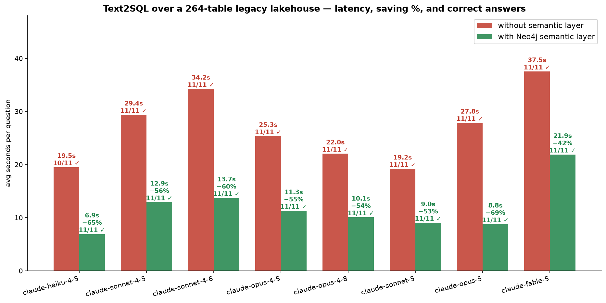

# Databricks lakehouse demo — Neo4j semantic layer (Neocarta) findings

## The setup


- **Data**: generated "legacy enterprise" lakehouse in `DATABRICKS_CATALOG` —
12 schemas, **264 tables, 5,614 columns**. Physical names are opaque codes
(`ods_crm_01.t_0140`, `dm_agg_10.a_1004`, `lnd_sls_raw.x_ord_2024`,
`x_feed_com_017` with unlabelled `fld_001..fld_024`). The business meaning
lives **only in COMMENT metadata**, like a real warehouse migrated from a
legacy system. Near-duplicate copies of every entity exist across landing
shards, archives, staging, marketing and HR homonyms.
- **Semantic layer**: Neo4j graph built from `information_schema` via Neocarta
`DatabricksSchemaConnector`, with table/column embeddings computed from the
COMMENT text and `REFERENCES` edges from declared Unity Catalog PK/FK.
- **Comparison** (only variable = is Neocarta in the loop?):
  - **WITHOUT**: `list_schemas` + `list_tables` + `get_table_columns` +
  `execute_sql` (may also read comments via `information_schema` in SQL —
  the strongest realistic baseline).
  - **WITH**: `get_context_by_table_hybrid_search` (one retrieval) + `execute_sql`.


The WITH path is two tools: hybrid retrieval in Neo4j (vector ∪ full-text on
Table, then Cypher expansion of columns and FK paths) then `execute_sql` on
the Databricks warehouse. Text2SQL is the model writing Databricks SQL from
the retrieved physical names — it is not a Neo4j procedure.

- **Scoring**: TABLES = the generated SQL used the governed table;
ANSWERS = the final answer contained the ground-truth values
(deterministic regex check in `eval/questions.yaml`).


## Latest sweep

The table and charts below are the current headline result:
**8 models × 11 questions × 2 modes**
(`eval/results-8models-anthropic.json`). Two changes vs the earlier run:

1. **Embeddings run locally** (`src/local_embeddings.py`,
  `all-mpnet-base-v2`, 768-dim) — no OpenAI dependency. This is why the GPT
   models are absent from this run; the earlier OpenAI-embedding numbers are
   preserved further down.


| Model             | tok w/o | tok with | SAVING  | time w/o SL | time with SL | ANSWERS w/o SL | ANSWERS with SL |
| ----------------- | ------- | -------- | ------- | ----------- | ------------ | -------------- | --------------- |
| claude-haiku-4-5  | 26,560  | 12,331   | **54%** | 19.5s       | 6.9s         | 10/11          | **11/11**       |
| claude-sonnet-4-5 | 26,946  | 14,324   | **47%** | 29.4s       | 12.9s        | 11/11          | **11/11**       |
| claude-sonnet-4-6 | 28,332  | 13,903   | **51%** | 34.2s       | 13.7s        | 11/11          | **11/11**       |
| claude-opus-4-5   | 25,722  | 11,784   | **54%** | 25.3s       | 11.3s        | 11/11          | **11/11**       |
| claude-opus-4-8   | 21,053  | 15,563   | **26%** | 22.0s       | 10.1s        | 11/11          | **11/11**       |
| claude-sonnet-5   | 20,561  | 14,427   | **30%** | 19.2s       | 9.0s         | 11/11          | **11/11**       |
| claude-opus-5     | 27,079  | 14,056   | **48%** | 27.8s       | 8.8s         | 11/11          | **11/11**       |
| claude-fable-5    | 17,210  | 13,960   | **19%** | 37.5s       | 21.9s        | 11/11          | **11/11**       |




### Key findings

- **Every model reaches 11/11 correct answers WITH the semantic layer.** Haiku
4.5 improves from 10/11 → 11/11 *because* of the layer.
- **19–54% fewer tokens and ~2× faster** across the whole Anthropic range,
cheap to flagship. WITH the layer each question converges to 2 tool calls
(one retrieval + one SQL) vs 4–24 brute-force calls without.
- Even models that already answer 11/11 without the layer pay a large
brute-force tax in tokens, latency, and $/month that the layer removes.
- **Token savings on more expensive models translate to larger dollar savings.**
Opus 4.5 drops from ~$0.1527/q without the layer to ~$0.0693/q with it
(~$1,527/mo vs ~$693/mo at 10,000 queries). The same ~54% token cut on
cheaper Haiku 4.5 is only ~$0.0327 → ~$0.0143 per question (~$327 vs
~$143/mo).
- **Weak/cheap models are unusable without the layer and excellent with it.**
gpt-4o-mini got 0/11 correct answers without the semantic layer (half the runs
hit the step limit while paging through `x_feed_*` extracts) but 8/11 with it —
at 73% fewer tokens and 5× faster.
- **Strong models pay a brute-force tax.** Opus and Sonnet do eventually find
the right tables — by running LIKE queries over hundreds of
`information_schema` comments — but burn ~2× the tokens and ~2× the wall-clock
time doing it, every single question, forever.
- **Cheap is not correct.** gpt-4o without the layer is frugal (9k tokens) but
only answers 4/11 correctly; with the layer it reaches 9/11 at 15% fewer
tokens. The savings story and the accuracy story are the same story: retrieval
replaces guessing.
- **One retrieval, done.** With the layer every model converges to the same
pattern: one hybrid-search call, one SQL call. Without it, 8–57 tool calls.


## One graph across warehouses

The Neo4j / Neocarta layer is **warehouse-polyglot** — the same connector pattern ingests metadata from **BigQuery, Snowflake, Databricks (Unity Catalog), generic JDBC, GCP Dataplex, CSV, and query-log JSON** into one graph. This demo uses `DatabricksSchemaConnector`; swapping the source is a connector change, not a rewrite of the agent, the graph, or the MCP tools.

This is not hypothetical: the companion
[Census ACS BigQuery benchmark](https://github.com/mbabari/census-neocarta-benchmark)
runs the *identical* recipe against **BigQuery** (278 near-identical public
tables), swapping only the connector. Same semantic layer, same MCP tools,
different warehouse — evidence that the approach is source-agnostic.

> Rule of thumb: reach for Neo4j when the answer lives in **more than one place** —
> the graph is what lets a single agent reason across all of your estates.

---


## Verified demo questions

See `eval/questions.yaml` — 11 questions with expected tables AND expected
answers (regex-checked). Examples:

1. Active paid subscription **and** open P1 ticket → `dm_agg_10.a_1004`
  (Bob Chen, Eve Rossi)
2. 2024 EMEA ARR by product → `dm_fin_20.f_2001` (Platform Enterprise 324,000)
3. Net revenue retention EMEA Dec 2024 → `dm_agg_10.a_1007` (1.08)
4. Collections/dunning queue attempts → `dm_fin_20.f_2004` (9001×3, 9002×2)


## Reproduce

```bash
cp .env.example .env   # warehouse + Neo4j + API keys
uv sync
uv run python src/seed_lakehouse.py
uv run python src/build_semantic_layer.py
uv run python src/benchmark.py                 # all configured models, without vs with

# No OpenAI account? Run embeddings locally, then re-embed once:
uv run python src/local_embeddings.py          # keep running in another shell
#   .env: EMBEDDING_MODEL=openai/all-mpnet-base-v2
#         EMBEDDING_API_BASE=http://127.0.0.1:8876/v1
uv run python src/build_semantic_layer.py --only embeddings

# Anthropic-only sweep (the 2026-08-20 run)
MODELS="anthropic/claude-haiku-4-5-20251001,anthropic/claude-sonnet-4-5-20250929,\
anthropic/claude-sonnet-4-6,anthropic/claude-opus-4-5-20251101,anthropic/claude-opus-4-8,\
anthropic/claude-sonnet-5,anthropic/claude-opus-5,anthropic/claude-fable-5" \
  uv run python src/benchmark.py

# Live side-by-side
uv run python src/agent.py --mode without
uv run python src/agent.py --mode with
```

